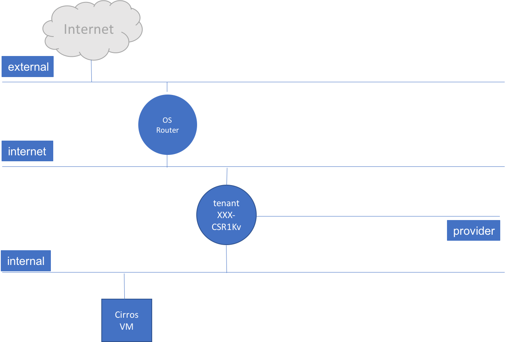

<!-- TOC depthFrom:1 depthTo:6 withLinks:1 updateOnSave:1 orderedList:0 -->

- [Logistics](#logistics)
- [Introduction to OpenStack](#introduction-to-openstack)
- [OpenStack Installation](#openstack-installation)
- [Lecture](#lecture)
- [Lab Environment Walkthrough](#lab-environment-walkthrough)
	- [HW topology](#hw-topology)
	- [Layer 3 Topology](#layer-3-topology)
	- [Connectivity](#connectivity)
	- [Testing VPN Lab Connectivity](#testing-vpn-lab-connectivity)
	- [Browse overall OpenStack cloud (some openstack CLI (host list etc), access computes etc)](#browse-overall-openstack-cloud-some-openstack-cli-host-list-etc-access-computes-etc)
- [Admin Tasks](#admin-tasks)
	- [Scenario (1 minute)](#scenario-1-minute)
	- [Create Flavors (5 minutes)](#create-flavors-5-minutes)
	- [Create Networks and Subnets (5 minutes)](#create-networks-and-subnets-5-minutes)
	- [Create images (5 minutes)](#create-images-5-minutes)
	- [Create Floating IP Pool (5 minutes)](#create-floating-ip-pool-5-minutes)
- [Tenant Tasks](#tenant-tasks)
	- [Create Networks and Subnets (5 minutes)](#create-networks-and-subnets-5-minutes)
	- [Create Internet Network and Subnet (3 minutes)](#create-internet-network-and-subnet-3-minutes)
	- [Create Internal Network and Subnet (2 minutes)](#create-internal-network-and-subnet-2-minutes)
	- [Create OpenStack Router (5 minutes)](#create-openstack-router-5-minutes)
		- [Attach router to provider network](#attach-router-to-provider-network)
	- [Launch Instances (10 minutes)](#launch-instances-10-minutes)
		- [Security Groups](#security-groups)
		- [Launch CSR1Kv Instance](#launch-csr1kv-instance)
		- [Launch CirrOS Instance](#launch-cirros-instance)
	- [Allowed Address Pairs](#allowed-address-pairs)
		- [Required neutron customizations](#required-neutron-customizations)
		- [Remote ssh access and verification tasks](#remote-ssh-access-and-verification-tasks)
		- [Openstack review tasks (infra, neutron, nova focus)](#openstack-review-tasks-infra-neutron-nova-focus)
		- [Openstack API features](#openstack-api-features)
- [Openstack orchestration](#openstack-orchestration)
	- [HEAT templates?](#heat-templates)
- [Neutron Intensive Tasks](#neutron-intensive-tasks)
- [OpenStack Review Tasks](#openstack-review-tasks)
- [Resources](#resources)
	- [Cisco DEvnet: OpenStack on your Laptop https://learninglabs.cisco.com/lab/openstack-install/step/1](#cisco-devnet-openstack-on-your-laptop-httpslearninglabsciscocomlabopenstack-installstep1)

<!-- /TOC -->
# Logistics
# Introduction to OpenStack
# OpenStack Installation
# Lecture
# Lab Environment Walkthrough

A

# Logistics

## Welcome
* Speaker intro: Luis Rueda, Gopal Naganaboyina
* What are your expectations? Any specific areas to focus?
* We tried to give emphasis to networking aspect.

## Time management
* There are 10 Sections, with an estimated completion time of 3 hr. 30 min.
* Every section has estimated time to complete. This is an estimate only. Please feel free to spend as much time as you like.
* Please plan a 5 min break, as needed, around 2 hr. mark or after completing sectio-X !!![comeback to edit]

## Questions
* Questions are most welcome. We ** request ** you to ask questions and make the session interactive.
* Self exploration is fun. At the end of each section, take a few minutes to review and ask questions if you have any.

## Openstack installation
* Openstack installation is not included in this session to make efficient use of time.
* Successful installtion 
---

# Introduction to Openstack

Refer to slides presented.


# Credentials

You will be given a paper copy of IP addresses, username, password info.

---

# Lab Connectivity

All the tasks in this guide can be done using OpenStack CLI or OpenStack Horizon's Dashboard, the examples will be using either one of them and it is up to the student to explore the different ways of doing it using the alternate method.

*Note: It is also possible to do things using other methods such as API or high level python libraries.*

Please note that a typical production NFV system or Openstack cloud includes components such as exclusive storage, DPDK network connectivity with PCIe or SR-IOv, OSS/BSS system, VNF management system, and Orchestration systems. In this lab, we have Openstack alone, which makes up ETSI model’s Virtual Infrastructure Manager (VIM).

The lab is built with 7 Cisco UCS C240 servers. The lab is behind a VPN server. To access the lab, you need to VPN into the VPN server. The VPN server and the lab are in USA and the access to VPN server is over Internet.

## HW topology

Access to the lab is over VPN tunnel. When you create the tunnel, VPN server will advertise a few routes to your laptop.


## Layer 3 Topology

Openstack Controller has connectivity to external-VLAN but not any Computes. Your access to Openstack cloud, which include Computes is through Controller.

There are a few other VLANs such as management but their details are not shown here.

Provider data center services and customer’s hypothetical CPE connections are emulated from a dedicated server, marked in the below topology as “provider DC cloud”. Other than hosting some services, this server is not playing any other role in this session.


## Connectivity

Below is a representation of Openstack cloud connectivity to the external networks. You will access the Controller over Internet. And, this cloud uses provider-VLAN (just a name) to reach: 1. Service Provider services, and 2. Customers’ branch office sites.

## Testing VPN Lab Connectivity

- VPN into lab gateway: Using Cisco Any Connect VPN client app, VPN into the lab gateway. It will setup a VPN tunnel and will install a few routes in your workstation. Use below details:

	- IP address: Refer credentials doc
	- Username: Refer credentials doc
	- Password: Refer credentials doc
	


- Verify routing on your desktop and check connectivity to Openstack controller

	- $ `ip route` (or `netstat -nr`)  //you should have route to 172.31.56.0/24
	- $ `ping 172.31.56.216`
	- From your browser, go [http://172.31.56.216](http://172.31.56.216)

- Review the section and discuss if you have any questions or comments.

---

# Openstack basic verification

Use command line interface (CLI) and Horizon dashboard and make basic verifications.

## Command line interface (CLI)

* ```ssh userxxx@172.31.56.216```
* 
Browse overall OpenStack cloud (some OpenStack CLI (host list etc), access computes etc)

---

# Admin Tasks

## Scenario (1 minute)

In this section, you would assume the role of an administrator of an OpenStack cloud. The goal is to create all the necessary elements for your users to be able to later create a virtual machine and make some basic verifications. This exercise exposes typical OpenStack admin environment.

Cloud owner name is Great-Cloud. All the participants are Great-Cloud’s administrators.

The following diagram depicts the topology:


## Source keystone_adminrc file

For all the commands that are executed using OpenStack CLI the first thing that need to be done is to source all the necessary variables that will allow us to authenticate with OpenStack.

```
$ source ~/keystonerc_adminXXX
```

## Create Flavors (5 minutes)
Lets start by creating some flavors that will be required for our VNFs (Virtual Machines).

A flavor is required for each of the following:

| flavor-name | vCPUs | vRAM (MB) | vDisk (GB) |
|--------------|-------|-----------|------------|
| tenantXXX-csr1kv.small | 2 | 4096 | 0 |
| tenantXXX-m1.nano | 1 | 64 | 1 |

In order to create a flavor with with 1 vCPU, 64 MB of vRAM and 1 GB of vDisk with a name of tenant99-m1.nano available to tenant99, the following command would be used:

```
$ openstack flavor create --project tenantXXX --ram 64 --vcpus 1 --disk 1 --private tenantXXX-m1.nano
+----------------------------+--------------------------------------+
| Field                      | Value                                |
+----------------------------+--------------------------------------+
| OS-FLV-DISABLED:disabled   | False                                |
| OS-FLV-EXT-DATA:ephemeral  | 0                                    |
| disk                       | 1                                    |
| id                         | 4382f519-24c2-4cff-8b94-cc22537dcd3c |
| name                       | tenantXXX-m1.nano                     |
| os-flavor-access:is_public | False                                |
| properties                 |                                      |
| ram                        | 64                                   |
| rxtx_factor                | 1.0                                  |
| swap                       |                                      |
| vcpus                      | 1                                    |
+----------------------------+--------------------------------------+
```

*Note: there are many other options that can be specified, these options can be explored by executing `openstack flavor create --help` command*

*Note: Replace XXX with your POD number. You will have this in your handout page*

## Create Networks and Subnets (5 minutes)

Let's start by creating the provider network, this is the only one that must be created using an admin user because it is the one that needs to provide values that only the OpenStack cloud administrator would have.

The values for Segmentation ID, Network Address, Gateway IP and Allocation Pools can be found in the following table, for **Physical Network** use **physnet1** for all students:

| Tenant | Segmentation ID | Network Address | Gateway IP | Allocation Pools | Physical Network |
|-----------|-----|-----------------|--------------|-------------------------------|----------|
| Tenant101 | 201 | 172.16.201.0/24 | 172.16.201.1 | 172.16.201.2 - 172.16.201.254 | physnet1 |
| Tenant102 | 202 | 172.16.202.0/24 | 172.16.202.1 | 172.16.202.2 - 172.16.202.254 | physnet1 |
| Tenant103 | 203 | 172.16.203.0/24 | 172.16.203.1 | 172.16.203.2 - 172.16.203.254 | physnet1 |
| Tenant104 | 204 | 172.16.204.0/24 | 172.16.204.1 | 172.16.204.2 - 172.16.204.254 | physnet1 |
| Tenant105 | 205 | 172.16.205.0/24 | 172.16.205.1 | 172.16.205.2 - 172.16.205.254 | physnet1 |
| Tenant106 | 206 | 172.16.206.0/24 | 172.16.206.1 | 172.16.206.2 - 172.16.206.254 | physnet1 |
| Tenant107 | 207 | 172.16.207.0/24 | 172.16.207.1 | 172.16.207.2 - 172.16.207.254 | physnet1 |
| Tenant108 | 208 | 172.16.208.0/24 | 172.16.208.1 | 172.16.208.2 - 172.16.208.254 | physnet1 |
| Tenant109 | 209 | 172.16.209.0/24 | 172.16.209.1 | 172.16.209.2 - 172.16.209.254 | physnet1 |
| Tenant110 | 210 | 172.16.210.0/24 | 172.16.210.1 | 172.16.210.2 - 172.16.210.254 | physnet1 |
| Tenant111 | 211 | 172.16.211.0/24 | 172.16.211.1 | 172.16.211.2 - 172.16.211.254 | physnet1 |
| Tenant112 | 212 | 172.16.212.0/24 | 172.16.212.1 | 172.16.212.2 - 172.16.212.254 | physnet1 |
| Tenant113 | 213 | 172.16.213.0/24 | 172.16.213.1 | 172.16.213.2 - 172.16.213.254 | physnet1 |
| Tenant114 | 214 | 172.16.214.0/24 | 172.16.214.1 | 172.16.214.2 - 172.16.214.254 | physnet1 |
| Tenant115 | 215 | 172.16.215.0/24 | 172.16.215.1 | 172.16.215.2 - 172.16.215.254 | physnet1 |
| Tenant116 | 216 | 172.16.216.0/24 | 172.16.216.1 | 172.16.216.2 - 172.16.216.254 | physnet1 |
| Tenant117 | 217 | 172.16.217.0/24 | 172.16.217.1 | 172.16.217.2 - 172.16.217.254 | physnet1 |
| Tenant118 | 218 | 172.16.218.0/24 | 172.16.218.1 | 172.16.218.2 - 172.16.218.254 | physnet1 |
| Tenant119 | 219 | 172.16.219.0/24 | 172.16.219.1 | 172.16.219.2 - 172.16.219.254 | physnet1 |
| Tenant120 | 220 | 172.16.220.0/24 | 172.16.220.1 | 172.16.220.2 - 172.16.220.254 | physnet1 |
| Tenant121 | 221 | 172.16.221.0/24 | 172.16.221.1 | 172.16.221.2 - 172.16.221.254 | physnet1 |
| Tenant122 | 222 | 172.16.222.0/24 | 172.16.222.1 | 172.16.222.2 - 172.16.222.254 | physnet1 |
| Tenant123 | 223 | 172.16.223.0/24 | 172.16.223.1 | 172.16.223.2 - 172.16.223.254 | physnet1 |
| Tenant124 | 224 | 172.16.224.0/24 | 172.16.224.1 | 172.16.224.2 - 172.16.224.254 | physnet1 |
| Tenant125 | 225 | 172.16.225.0/24 | 172.16.225.1 | 172.16.225.2 - 172.16.225.254 | physnet1 |
| Tenant126 | 226 | 172.16.226.0/24 | 172.16.226.1 | 172.16.226.2 - 172.16.226.254 | physnet1 |
| Tenant127 | 227 | 172.16.227.0/24 | 172.16.227.1 | 172.16.227.2 - 172.16.227.254 | physnet1 |
| Tenant128 | 228 | 172.16.228.0/24 | 172.16.228.1 | 172.16.228.2 - 172.16.228.254 | physnet1 |
| Tenant129 | 229 | 172.16.229.0/24 | 172.16.229.1 | 172.16.229.2 - 172.16.229.254 | physnet1 |

The other two required networks can be created with a user that has _member_ privileges, but can also be created using this admin user if desired.

Step 1 - Go to Admin -> Network -> Networks and click on **Create Network**


Step 2 - Fill in all the values for the network and click on **Next**


Step 3 - Fill in all the values for the subnet and click on **Next**


Step 4 - Fill in all the values for the subnet details and click on **Create**


Step 5 - A green notification should appear on the top-right corner indicating successful creation of the network and subnet


## Create images (5 minutes)

We need to create the following images in glance.

| Image Name | Format | Shared | File Name |
|--------------|-------|-----------|------------|
| tenantXXX-csr1kv-3.16.6s | qcow2 | No | csr3.16.6s.qcow2 |
| tenantXXX-cirros-0.4.0-x86_64 | qcow2 | No | cirros-0.4.0-x86_64-disk.img |

Next you will find the steps to upload the image either via Horizon or OpenStack CLI.

*Note: You need to execute the procedure for all the images in the table. The procedure is explained for one image but the same procedure is valid for all of them.*

The files can be downloaded from this [link](http://172.31.56.131/download/) and from the command line they can be downloaded using wget (e.g. `wget http://172.31.56.131/download/cirros-0.4.0-x86_64-disk.img`

Upload image using single OpenStack CLI command:
```
$ openstack image create --project tenantXXX --disk-format qcow2 --file cirros-0.4.0-x86_64-disk.img tenantXXX-cirros-0.4.0-x86_64
+------------------+------------------------------------------------------+
| Field            | Value                                                |
+------------------+------------------------------------------------------+
| checksum         | 443b7623e27ecf03dc9e01ee93f67afe                     |
| container_format | bare                                                 |
| created_at       | 2018-01-10T20:54:36Z                                 |
| disk_format      | qcow2                                                |
| file             | /v2/images/51b8a82f-339a-4fb9-89f5-79a557321510/file |
| id               | 51b8a82f-339a-4fb9-89f5-79a557321510                 |
| min_disk         | 0                                                    |
| min_ram          | 0                                                    |
| name             | tenant99-cirros-0.4.0-x86_64                         |
| owner            | 1e2b5c63d1f14091b237acf064cc9db6                     |
| protected        | False                                                |
| schema           | /v2/schemas/image                                    |
| size             | 12716032                                             |
| status           | active                                               |
| tags             |                                                      |
| updated_at       | 2018-01-10T20:54:36Z                                 |
| virtual_size     | None                                                 |
| visibility       | private                                              |
+------------------+------------------------------------------------------+
```

## Create Floating IP Pool (5 minutes)

Step 1 - Go to Admin -> Network -> Floating IPs an click on **Allocate IP To Project**


Step 2 - Fill in the values and click on **Allocate Floating IP**


Step 3 - A green notification should appear on the top-right corner indicating successful allocation of floating IP

*Note: There is a bug when trying to assign a specific IP from Horizon dashboard, for the moment this must be done from the CLI if a specific IP is required.*

```
openstack floating ip create --project tenantXXX --floating-ip-address 172.31.57.1XX external
+---------------------+--------------------------------------+
| Field               | Value                                |
+---------------------+--------------------------------------+
| created_at          | 2018-01-21T22:46:21Z                 |
| description         |                                      |
| fixed_ip_address    | None                                 |
| floating_ip_address | 172.31.57.199                        |
| floating_network_id | 06ca5380-84eb-46b1-b0db-8fa038f72998 |
| id                  | 958a5fd7-72ef-426a-9aef-dd6bbbac6501 |
| name                | 172.31.57.199                        |
| port_id             | None                                 |
| project_id          | 1e2b5c63d1f14091b237acf064cc9db6     |
| revision_number     | 0                                    |
| router_id           | None                                 |
| status              | DOWN                                 |
| updated_at          | 2018-01-21T22:46:21Z                 |
+---------------------+--------------------------------------+
```

# Tenant Tasks

## Create Networks and Subnets (5 minutes)

As a tenant user we will need to create two networks, one that connects CSR1Kv to the Internet and the other one that will connect the internal VM to CSR1Kv

## Create Internet Network and Subnet (3 minutes)

Lets start by creating the Internet network.

Since the Internet network does not have connectivity to the outside world (It is only relevant for the tenant) the same value can be reused by all tenants.

|  Tenant   | Network Address  |  Gateway IP   |         Allocation Pools        |
|-----------|------------------|---------------|---------------------------------|
| TenantXXX | 192.168.254.0/24 | 192.168.254.1 | 192.168.254.2 - 192.168.254.254 |

Step 1 - Go to Project -> Network -> Networks and click on **Create Network**


Step 2 - Fill in all the values for the network and click on **Next**


Step 3 - Fill in all the values for the subnet and click on **Next**


Step 4 - Fill in all the values for the subnet details and click on **Create**


Step 5 - A green notification should appear on the top-right corner indicating successful creation of the network and subnet


## Create Internal Network and Subnet (2 minutes)

Lets create now the Internal Network. This time we will do it via OpenStack CLI.

```
$ openstack network create tenant99-internal
+---------------------------+--------------------------------------+
| Field                     | Value                                |
+---------------------------+--------------------------------------+
| admin_state_up            | UP                                   |
| availability_zone_hints   |                                      |
| availability_zones        |                                      |
| created_at                | 2018-01-22T00:27:01Z                 |
| description               |                                      |
| dns_domain                | None                                 |
| id                        | bd11919c-ed33-4229-8376-f5e063ad7f0a |
| ipv4_address_scope        | None                                 |
| ipv6_address_scope        | None                                 |
| is_default                | False                                |
| is_vlan_transparent       | None                                 |
| mtu                       | 1450                                 |
| name                      | tenant99-internal                    |
| port_security_enabled     | True                                 |
| project_id                | 1e2b5c63d1f14091b237acf064cc9db6     |
| provider:network_type     | None                                 |
| provider:physical_network | None                                 |
| provider:segmentation_id  | None                                 |
| qos_policy_id             | None                                 |
| revision_number           | 2                                    |
| router:external           | Internal                             |
| segments                  | None                                 |
| shared                    | False                                |
| status                    | ACTIVE                               |
| subnets                   |                                      |
| tags                      |                                      |
| updated_at                | 2018-01-22T00:27:01Z                 |
+---------------------------+--------------------------------------+

$ openstack subnet create --network tenant99-internal --subnet-range 192.168.255.0/24 tenant99-internal-subnet
+-------------------------+--------------------------------------+
| Field                   | Value                                |
+-------------------------+--------------------------------------+
| allocation_pools        | 192.168.255.2-192.168.255.254        |
| cidr                    | 192.168.255.0/24                     |
| created_at              | 2018-01-22T00:46:22Z                 |
| description             |                                      |
| dns_nameservers         |                                      |
| enable_dhcp             | True                                 |
| gateway_ip              | 192.168.255.1                        |
| host_routes             |                                      |
| id                      | 2bb680e4-2da0-4f51-9b52-ad41e006ad43 |
| ip_version              | 4                                    |
| ipv6_address_mode       | None                                 |
| ipv6_ra_mode            | None                                 |
| name                    | tenant99-internal-subnet             |
| network_id              | 2f25227b-80b0-4f31-b11b-9b2d8066127c |
| project_id              | 1e2b5c63d1f14091b237acf064cc9db6     |
| revision_number         | 0                                    |
| segment_id              | None                                 |
| service_types           |                                      |
| subnetpool_id           | None                                 |
| tags                    |                                      |
| updated_at              | 2018-01-22T00:46:22Z                 |
| use_default_subnet_pool | None                                 |
+-------------------------+--------------------------------------+
```

Since the Internal network does not have connectivity to the outside world either the same value can be reused by all tenants.

|  Tenant  | Network Address  |  Gateway IP   |         Allocation Pools        |
|----------|------------------|---------------|---------------------------------|
| TenantXX | 192.168.255.0/24 | 192.168.255.1 | 192.168.255.2 - 192.168.255.254 |

## Create OpenStack Router (5 minutes)
- tenantXX-router

Step 1 - Go to Project -> Network -> Routers and click on **Create Router**


Step 2 - Fill in all the values for the router and click on **Create Router** button


Step 3 - A green notification should appear on the top-right corner indicating successful creation of the router


### Attach router to provider network

Step 1 - Go to Project -> Network -> Routers and click on the router that was created in the previous step, go to the Interfaces tab and click on **Add Interface**


Step 2 - Select tenantXX-internet from the drop-down list of subnets and click on **Submit**


Step 3 - A green notification should appear on the top-right corner indicating successful attach of the subnet to the router


## Launch Instances (10 minutes)

### Security Groups

In order for our CSR1Kv instance to work properly, we have to create a security group and allow all inbound traffic that is desired. For the purpose of our lab, we will create multiple security groups so that they can be easily identifiable.

The following table lists the security groups that need to be created:
| Security Group Name  | Rule | Direction | Remote | CIDR |
|----------------------|------|-----------|--------|------|
| tenantXXX-allow_ssh  | SSH  | N/A       | CIDR   | 0.0.0.0/0 |
| tenantXXX-allow_icmp | ALL ICMP | Ingress | CIDR | 0.0.0.0/0 |

Step 1 - Go to Project -> Network -> Security Groups and click on **Create Security Group**.


Step 2 - Type the security group name (do not forget to replace XXX with your POD number) and click on **Create Security Group**.


Step 3 - A green notification should appear on the top-right corner indicating successful creation of the security group.


Step 4 - Click on **Manage Rules** for the security group that was just created.


Step 5 - Click on **Add Rule**.


Step 6 - Fill in the values based on the above table and click on **Add**.


Step 7 - A green notification should appear on the top-right corner indicating successful add of the security group rule.


We will be attaching the security groups to the instance when creating the instance.

### Launch CSR1Kv Instance

There are several steps required to create the instance, and there are multiple ways to do this. The suggested way is via OpenStack CLI, this will allow us to create the instance with a single command and provide all the proper IPv4 addresses.

Step 1 - Issue the `openstack network list` command to find the IDs for the networks that we want to attach to CSR1Kv.
```
$ openstack network list
+--------------------------------------+-------------------+--------------------------------------+
| ID                                   | Name              | Subnets                              |
+--------------------------------------+-------------------+--------------------------------------+
| 06ca5380-84eb-46b1-b0db-8fa038f72998 | external          | 9b34213c-eff1-4008-a387-d08ee49b5ee0 |
| 2c3d2f04-41ed-4c1a-956d-e57f61758f1e | tenant99-internet | 49eaed11-788e-41dd-8823-12964c9f90e5 |
| 2f25227b-80b0-4f31-b11b-9b2d8066127c | tenant99-internal | 2bb680e4-2da0-4f51-9b52-ad41e006ad43 |
| 631e32e7-8e1f-42fb-a927-ec1d7dc31293 | tenant-net        | f57b9855-42fb-406a-bb31-c25036078f07 |
| 90c70132-0ea7-4362-8ab4-aff50986d012 | tenant99-provider | e7210532-3d56-4eaf-9826-0711756ad3f4 |
+--------------------------------------+-------------------+--------------------------------------+
```

Step 2 - After the networks have been identified, replace each net-id with the corresponding ID found with in *Step 1*
```
openstack server create --flavor tenant99-csr1kv.small --image tenant99-csr1kv-3.16.6s \
  --nic net-id=2c3d2f04-41ed-4c1a-956d-e57f61758f1e,v4-fixed-ip=192.168.254.10 \
	--nic net-id=90c70132-0ea7-4362-8ab4-aff50986d012,v4-fixed-ip=172.16.99.10 \
	--nic net-id=2f25227b-80b0-4f31-b11b-9b2d8066127c,v4-fixed-ip=192.168.255.1 \
	--security-group tenant99-allow_ssh \
	--security-group tenant99-allow_icmp \
	tenant99-csr1kv
```

*Note: for tenantXX-provider replace the IPv4 address with an appropiate network from the tenantXX-provider network.*

### Launch CirrOS Instance

In order to test connectivity from behind the CSR1Kv, we will be creating a CirrOS instance that will act as our PC in the topology.

This time we will launch the CirrOS VM from the horizon dashboard.


Step 1 - Go to Project -> Instance -> Routers and click on **Create Instance**


Step 2 - Fill in all the values for the instance and click on **Create Router** button


Step 3 - A green notification should appear on the top-right corner indicating successful creation of the instance


## Allowed Address Pairs

Now let's go to CirrOS instance and try to execute a ping from it to the CSR1Kv interface, you will notice that ping will work (if this is not working, ensure that you attached the allow_icmp security group, if everything else fails, go [here](#neutron-intensive-tasks)).

However if from the CirrOS instance you try to ping the IPv4 address of tenantXX-provider network, it will fail. Can you figure out why it is failing ? Hint: It does not have anything to do with routing.

The problem happens because by default OpenStack will create a rule for the newly created port, stating that only traffic going to the port's IPv4 address is allowed. This behavior although desired when using OpenStack for server instances, is not desirable for VNFs because traffic may be routed through the VNF but may not be intended to the VNF itself (think of a router that routes IPv4 packets destined to other networks).

To correct this problem we have to identify the ports of the router and change add a filter to allow traffic going to any IPv4 network (i.e. 0.0.0.0/0).

To do that we will use the OpenStack CLI.

Step 1 - Identify the port that requires changes (since our CSR1Kv VNF has three ports, we will need to execute the procedure in each one of them)
```
$ openstack port list
```

Step 2 - After getting the port ID from the above command, execute the `openstack port show <ID>` command to see the current configuration for the port
```
$ openstack port show
```

Step 3 - Set the allowed address pairs to 0.0.0.0/0 for the port using the `openstack port set` command
```
$ openstack port set --allowed-address ip-address=0.0.0.0/0 0aa5db92-f80f-40e4-a15b-ee6aaa
```

*Note: repeat for the other two ports*

### Required neutron customizations
- mac address changes
### Remote ssh access and verification tasks
### Openstack review tasks (infra, neutron, nova focus)
### Openstack API features
# Openstack orchestration
## HEAT templates?
- try doing some of the tasks that were done manually

# Neutron Intensive Tasks

# OpenStack Review Tasks

In this concluding section, you will try to get an overall view of the Openstack cloud that you just worked on. Try to make sense of the output of each command. These some commonly used monitoring commands. Not every command and out may have a direct connection to the work that you did so far. The goal is to get an overall idea, not necessarily a detailed one.

Please note that a typical production NFV system or Openstack cloud includes components such as exclusive storage, high performance network connectivity with PCIe or SR-IOv, OSS/BSS system, VNF management system, and Orchestration systems. In this lab, we have Openstack alone, which makes up ETSI model’s Virtual Infrastructure Manager (VIM).

1.1.	Acquire admin environment parameters (discuss with Luis)

```
$ source ~/keystonerc_admin
```

1.2.	Cloud overview
```
$ openstack-service list
```

```
$ openstack-service status
```

```
$ source keystonerc_admin
```

1.3.	Miscellaneous
```
openstack command list
```

```
openstack command list --group openstack.compute.v2
```

```
openstack command list --group openstack.network.v2
```

```
brctl show
```

```
ovs-vsctl show
```

```
ovs-vsctl list-br
```

```
ip netns
```

1.4.	Compute
```
openstack compute service list
```

```
openstack hypervisor list
```

```
openstack hypervisor stats show
```

```
openstack hypervisor show <hypervisor>
```

```
openstack usage list
```

```
openstack host list
```

```
openstack host show <host name>
```

```
openstack flavor list
```

```
openstack server list --all-projects
```
```
openstack quota show Great-Customer
```

1.5.	Network
```
ovs-vsctl list-br
```
```
openstack network list
```
```
openstack network <net name or ID>
```
```
openstack subnet list
```
```
openstack subnet <subnet name or ID>
```
```
openstack router list
```
```
openstack network agent list
```
```
openstack port list
```

1.6.	Identity
```
openstack project list
```
```
openstack role list
```
```
openstack user list
```

# Resources
## Cisco DEvnet: OpenStack on your Laptop https://learninglabs.cisco.com/lab/openstack-install/step/1
